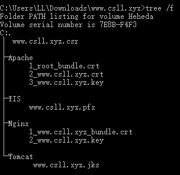

## 目的和准备  
### 目的  
1. 搭建一个Hexo博客
2. 使用Nginx作为服务器
3. 使用SSL证书（HTTPS连接方式）  

### 准备  
1. 一台Linux云主机（作为服务器）
2. 本地Linux 或 MacOS 或 Windows+Putty （用于远程控制和文件传输）
3. 一个有效域名（用于申请SSL证书，否则只能HTTP访问）
4. 一颗耐心

## Nginx的安装与配置  
### 下载和安装  
``` bash
$ sudo apt-get update 
$ sudo apt-get install nginx
$ sudo service nginx start
```
### 验证安装  
- 方法1  
``` bash
$ wget localhost
--2018-05-06 16:34:55--  http://localhost/
Resolving localhost (localhost)... 127.0.0.1
Connecting to localhost (localhost)|127.0.0.1|:80... connected.
HTTP request sent, awaiting response... 200 OK
Length: 612 [text/html]
Saving to: ‘index.html’

index.html          100%[===================>]     612  --.-KB/s    in 0s      

2018-05-06 16:34:55 (110 MB/s) - ‘index.html’ saved [612/612]


$ cat index.html
<!DOCTYPE html>
<html>
<head>
<title>Welcome to nginx!</title>
<style>
    body {
        width: 35em;
        margin: 0 auto;
        font-family: Tahoma, Verdana, Arial, sans-serif;
    }
</style>
</head>
<body>
<h1>Welcome to nginx!</h1>
<p>If you see this page, the nginx web server is successfully installed and
working. Further configuration is required.</p>

<p>For online documentation and support please refer to
<a href="http://nginx.org/">nginx.org</a>.<br/>
Commercial support is available at
<a href="http://nginx.com/">nginx.com</a>.</p>

<p><em>Thank you for using nginx.</em></p>
</body>
</html>
```
- 方法2  
打开浏览器，输入地址localhost，若出现Nginx欢迎界面即成功  


### Nginx配置SSL证书实现https访问
- 从域名商处可以购买免费SSL证书(以腾讯云为例)  
  
  
  
  
等待几分钟到几小时之后，可以下载证书  
  
  
以下只介绍Nginx证书的配置，其他证书请参阅[这个链接](https://cloud.tencent.com/document/product/400/4143)

- 将SSL证书传输到远程服务器
因为用的是Nginx服务器，所以只需要把Nginx文件夹里的内容上传到远程服务器。  
(此处使用scp工具, -i表示验证文件 -P表示端口 -r表示递归传输文件夹)  
``` bash
格式：scp [options] [-r 本地文件夹 | 本地文件] 远程用户名@远程主机地址:远程路径
$ scp -i aws.pem -p 22 -r nginx ubuntu@ec2-1-1-1-1.us-west-2.compute.amazonaws.com:/home/ubuntu/
```

- 远程主机的配置  
1. 一般情况下，nginx安装位置为/etc/nginx  
``` bash
$ cd /etc/nginx  //转到nginx安装位置
$ sudo mkdir cert/  //创建文件夹，用来保存证书
$ sudo mv [证书位置]/* cert/  //example: sudo mv ~/nginx/* cert/
$ sudo vi sites-enabled/[你的域名]  //example: sudo vi sites-enabled/csll.xyz
```
2. 在上面的文件中加入以下内容
``` code
//中文注释仅在此做为注释，保存文件时请连同"//"一起全部删除，否则会报错
server {
    listen 443;
    server_name csll.xyz; //你的域名
    ssl on;
    root /var/www/html/; //网页文件存放文件夹，后续改成hexo的文件夹位置
    index index.html index.htm; //上述文件夹的主页名称
    ssl_certificate  cert/1_www.csll.xyz_bundle.crt; //改成你的证书文件名(*.crt/*.pem)
    ssl_certificate_key cert/2_www.csll.xyz.key; //改成你的证书文件名(*.key)
    ssl_session_timeout 5m;
    ssl_ciphers ECDHE-RSA-AES128-GCM-SHA256:ECDHE:ECDH:AES:HIGH:!NULL:!aNULL:!MD5:!ADH:!RC4;
    ssl_protocols TLSv1 TLSv1.1 TLSv1.2;
    ssl_prefer_server_ciphers on;
    location / {
        index index.html index.htm;
    }
}
server {
    listen 80;
    server_name csll.xyz; //你的域名
    rewrite ^(.*)$ https://$host$1 permanent; //强行跳转为https请求
}
```
3. 进行测试，看到successful即为配置正确  
``` bash
$ sudo nginx -t
nginx: the configuration file /etc/nginx/nginx.conf syntax is ok
nginx: configuration file /etc/nginx/nginx.conf test is successful
``` 
4. 重启nginx  
``` bash
$ sudo service nginx restart
```
5. 测试  
在浏览器中输入域名，会自动跳转为https://[域名]  
  
如果没有跳转，请检查/etc/nginx/sites-enabled/下是否有以该域名命名的文件，若没有，回到本节第2步。  

## Hexo的安装与配置 
### Hexo的安装
``` bash
$ sudo apt-get update //更新软件源

//不推荐使用的nodejs安装，版本较老，可能会出现异常错误
$ sudo apt-get install nodejs  

//推荐使用的安装nodejs的安装
$ curl -sL https://deb.nodesource.com/setup_6.x | sudo -E bash -
$ sudo apt-get install -y nodejs  

$ sudo apt-get install npm  //安装npm

$ sudo npm install hexo-cli -g //安装hexo
```

### 初始化新的博客
``` bash
$ hexo init blog //在当前目录下生成一个名为blog的文件夹
$ cd blog
$ npm install 
$ sudo hexo server -p 6666 //在6666端口运行hexo
```
此时在浏览器中打开localhost:6666即可看到最原始的hexo博客

### 配置博客(以下命令都在blog/目录下)
``` bash
$ vi _config.yml
```
修改以下内容：  
``` yml
# Site
title: Triumphal's Blog //博客标题
subtitle: //副标题
description: //描述
keywords: //关键词
author: Leo //作者
language: zh-Hans //语言
timezone: Asia/Shanghai //时区

# URL
## If your site is put in a subdirectory, set url as 'http://yoursite.com/child' and root as '/child/'
url: http://csll.xyz //网页域名
root: /     //指定根目录，可保持默认
permalink: :year/:month/:day/:title.html //永久链接，用于设置博文链接
permalink_defaults:
```
应用设置  
``` bash
$ hexo d -g //应用修改重新生成网页文件
$ sudo hexo server -p 6666 //在6666端口运行hexo
```
此时在浏览器中打开localhost:6666即可看到配置后的hexo博客  

### 主题配置（以NexT主题为例）(以下命令都在blog/目录下)
``` bash
$ git clone https://github.com/theme-next/hexo-theme-next themes/next
$ vi _config.yml
```
修改其中的theme属性，将主题变为next：   
``` yml
# Extensions
## Plugins: https://hexo.io/plugins/
## Themes: https://hexo.io/themes/
theme: next
```
 
接下来个性化配置NexT主题，个性化配置请参阅：[hexo的next主题个性化教程](http://shenzekun.cn/hexo%E7%9A%84next%E4%B8%BB%E9%A2%98%E4%B8%AA%E6%80%A7%E5%8C%96%E9%85%8D%E7%BD%AE%E6%95%99%E7%A8%8B.html) 
``` bash
$ vi themes/next/_config.yml
```
应用设置  
``` bash
$ hexo d -g //应用修改重新生成网页文件
$ sudo hexo server -p 6666 //在6666端口运行hexo
```
此时在浏览器中打开localhost:6666即可看到配置后的，主题为NexT的hexo博客   

### 将Hexo的网上搭建在Nginx上
即将Nginx的主页设置为Hexo博客的主页
``` bash
$ sudo vi /etc/nginx/sites-enabled/[你的域名]
```
``` code
将其中的
server {
    ...
    root /var/www/html/; //网页文件存放文件夹，后续改成hexo的文件夹位置
    ...
}
...
改成
server {
    ...
    root [博客所在路径]/blog/public/; //改成hexo blog的文件夹位置
    ...
}
...
```
然后重启nginx服务  
``` bash
$ sudo service nginx restart 
```

## Hexo的博文操作  
### 创建博文操作
``` bash
$ cd [博客所在路径]/blog
$ hexo new [博文的名字]  //创建一个新的博文，路径在source/_posts/
$ hexo d -g
```

### 删除博文操作
``` bash
$ cd [博客所在路径]/blog/source/_posts/
$ ls
$ rm [要删除的博文].md
$ cd ../..
$ hexo d -g
```

### 如何在博文里加载本地图片
``` bash
$ cd [博客所在路径]/blog
$ vi _config.yml
```
``` yml
将其中的
#post_asset_folder:false
改为
post_asset_folder:false
```
然后安装一个可以添加本地图片的插件  
``` bash
$ npm install hexo-asset-image --save
```
此时新建一个新的文件时，会同时创建一个同名的文件夹，用于存放图片等文件:  
``` bash
$ hexo new test
INFO  Created: ~/blog/source/_posts/test.md
$ ls source/_posts/
test.md     test
```

## 大功告成
至此，一个强制用HTTPS协议的，基于Nginx服务器和Hexo博客模板的博客就完全搭建完成了，如有疑问，欢迎发邮件：[cn.ll@outlook.com](https://www.baidu.com)

## 参考网页&感谢  
1. [nginx配置ssl证书实现https访问](https://www.cnblogs.com/tianhei/p/7726505.html)  
2. [在hexo的博文中插入图片](https://blog.csdn.net/sugar_rainbow/article/details/57415705)  
3. [Linux下使用Hexo搭建博客](https://www.cnblogs.com/zhaoyu1995/p/6239950.html) 
