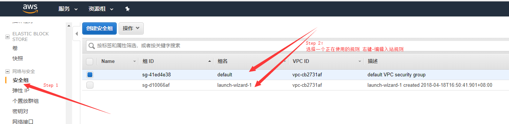
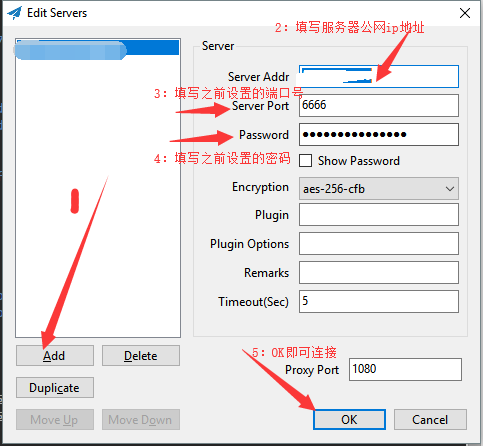

## 前言
本文主要介绍Shadowsocks的简单配置，准备工作：
- 一台远程服务器

## Shadowsocks的安装和配置
1. shadowsocks安装
``` bash
$ sudo apt-get update
$ sudo apt-get install python-pip
$ sudo pip install shadowsock
```
<!--More-->

2. shadowsocks配置
``` bash
$ vi /etc/shadowcocks.json
```

``` json
{
    "server":"0.0.0.0",
    "local_address":"127.0.0.1",
    "local_port":1080,
    "port_password":
    {
        "6666":"password",    //此处表示ss服务连接端口，后面表示密码
        "7777":"password"
    },
    "timeout":300,
    "method":"aes-256-cfb",
    "workers":1
}
```

3. 在服务器运行shadowsocks
``` bash
$ ssserver -c /etc/shadowsocks.json -d start   //后台运行
$ ssserver -c /etc/shadowsocks.json -d stop    //后台停止
```

## AWS主机打开端口

  


## 客户端的配置和连接
- Windows版：[https://github.com/shadowsocks/shadowsocks-windows/releases](https://github.com/shadowsocks/shadowsocks-windows/releases)
- 其他版本请访问Github仓库：[https://github.com/shadowsocks/](https://github.com/shadowsocks/)
  
**注意：一个端口仅能绑定一个Shadowsocks客户端**  
  
**一个查看配置是否成功的网站**  
[https://www.ipqi.co/](https://www.ipqi.co/)  
  
